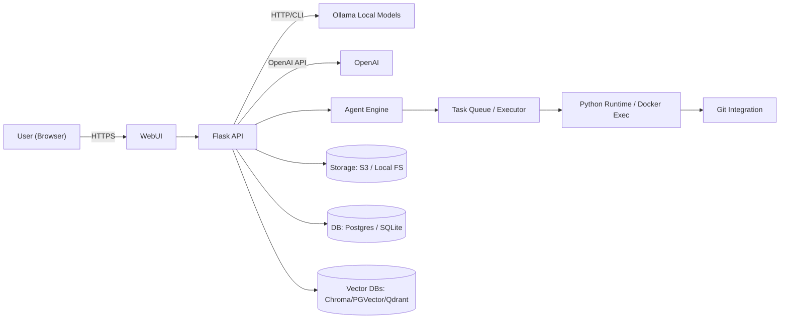
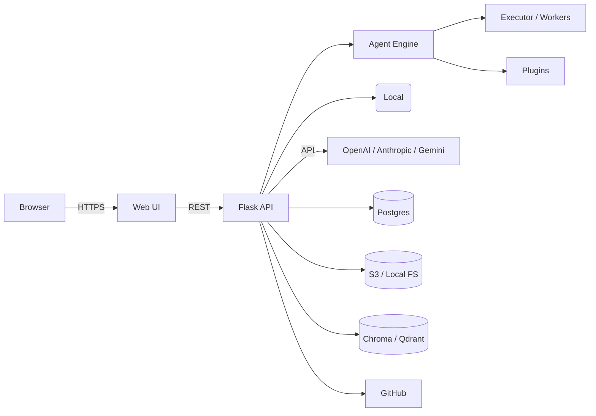

# 🚀 Agent System — Enterprise AI Platform

[](LICENSE)
[]()
[]()
[]()
[]()

> Full-stack, enterprise-grade AI platform for local, hybrid and cloud deployments. Multi-agent orchestration, model routing, RAG, workspace, integrated terminal, Git/GitHub integration, plugin architecture, and secure multi-tenant-ready features.

---

Table of Contents
-----------------

- [🌌 About](#🌌-about)
- [✨ Overview](#✨-overview)
- [🎯 Vision](#🎯-vision)
- [💡 Mission](#💡-mission)
- [🔥 Highlights](#🔥-highlights)
- [⭐ Features](#⭐-features)
- [🧠 AI Capabilities](#🧠-ai-capabilities)
  - [Multi-Agent AI](#multi-agent-ai)
  - [Local AI](#local-ai)
  - [Cloud AI](#cloud-ai)
  - [Model Routing](#model-routing)
  - [Model Comparison](#model-comparison)
  - [RAG](#rag)
  - [Memory](#memory)
  - [Voice](#voice)
  - [Image Generation](#image-generation)
  - [Code Execution & Python Runtime](#code-execution--python-runtime)
  - [Internet Search](#internet-search)
  - [Plugin System](#plugin-system)
  - [Workflow Engine](#workflow-engine)
- [🤖 Supported Models](#🤖-supported-models)
- [🔌 Integrations](#🔌-integrations)
- [🧩 Plugins Architecture](#🧩-plugins-architecture)
- [🛠 Built-in Tools](#🛠-built-in-tools)
- [🏗 Architecture](#🏗-architecture)
- [📐 System Design Decisions](#📐-system-design-decisions)
- [🔄 Workflow (Processing Pipeline)](#🔄-workflow-processing-pipeline)
- [📊 Performance & Optimization](#📊-performance--optimization)
- [🔐 Security & Privacy](#🔐-security--privacy)
- [🌐 Deployment](#🌐-deployment)
  - [Cloud Examples](#cloud-examples)
  - [Self-hosting](#self-hosting)
  - [Docker Compose](#docker-compose)
  - [Kubernetes (Helm friendly)](#kubernetes-helm-friendly)
- [📦 Installation & Quick Start](#📦-installation--quick-start)
- [⚙️ Configuration & Environment Variables](#⚙️-configuration--environment-variables)
- [💻 Development & Testing](#💻-development--testing)
- [📚 API Documentation (Selected Endpoints)](#📚-api-documentation-selected-endpoints)
- [🗄 Database & Storage](#🗄-database--storage)
- [🧠 Machine Learning Pipeline](#🧠-machine-learning-pipeline)
- [📁 Project Structure](#📁-project-structure)
- [🧬 Technology Stack](#🧬-technology-stack)
- [🛠 Developer Tools & Requirements](#🛠-developer-tools--requirements)
- [🚀 Quick Start & Examples](#🚀-quick-start--examples)
- [🔧 Advanced Configuration](#🔧-advanced-configuration)
- [🐳 Docker & ☸️ Kubernetes Manifests](#🐳-docker--️-kubernetes-manifests)
- [🔄 CI/CD & Release Workflow](#🔄-cicd--release-workflow)
- [📈 Roadmap & Milestones](#📈-roadmap--milestones)
- [🚧 Known Issues & Troubleshooting](#🚧-known-issues--troubleshooting)
- [📝 Changelog & Migration Guide](#📝-changelog--migration-guide)
- [🤝 Contributing & Community](#🤝-contributing--community)
- [📜 License & Legal](#📜-license--legal)
- [🙏 Acknowledgements](#🙏-acknowledgements)
- [📞 Contact & Links](#📞-contact--links)

---

🌌 About
--------

Agent System is an enterprise-ready AI orchestration platform that enables teams to run, orchestrate, and manage large language models (LLMs) and multi-agent workflows both locally and in the cloud. It unifies model management (including Ollama local models), agent orchestration, workspace, Git integration, RAG pipelines, and plugin tooling into a single self-hosted application.

This repository provides the backend (Flask-based), a modern web UI, and a modular architecture built for extensibility, security, and enterprise deployment.

---

✨ Overview
-----------

- Single-repo solution for running AI agents and models.
- Supports local models (via Ollama), OpenAI-compatible backends, and hybrid cloud providers.
- Integrated developer workspace (file explorer, Monaco editor, terminal) for rapid prototyping and code execution.
- Multi-agent orchestration with dedicated agents (Planner, Developer, Reviewer, Security, Executor, GitHub, Architect).
- Model management, comparison, and fallback routing.
- Support for RAG, vector stores, memory, plugins and connectors.

Mermaid overview (architecture):



---

🎯 Vision
---------

To provide organizations with a production-grade platform to harness state-of-the-art LLMs and multi-agent workflows across local and cloud environments, ensuring security, data sovereignty, and an extensible plugin and developer experience.

---

💡 Mission
----------

Deliver an enterprise-ready, extensible, local-first AI platform that enables secure model orchestration, reproducible agent pipelines, and developer productivity out-of-the-box.

---

🔥 Highlights
-------------

- Local-first model hosting with Ollama support.
- Enterprise-grade model routing and fallback.
- Multi-agent orchestration pipeline.
- Built-in workspace & terminal for reproducible development.
- Git/GitHub integration for automated commits and PR flows.
- Vector search and RAG-ready (Chroma, Qdrant, PGVector-compatible).
- Plugin ecosystem and OpenAPI function support.

---

⭐ Features
-----------

- Authentication and RBAC-ready architecture.
- Ollama model detection and management.
- OpenAI-compatible endpoints.
- Multi-conversation chat UI, streaming responses, markdown support.
- File explorer: upload, preview, edit, download, and manage workspace.
- Monaco-based code editor with autosave and multi-language support.
- Terminal with streaming output and process controls.
- Pipeline orchestration for end-to-end tasks.
- Agents with independent memory, logs, and status.
- Persistence options (SQL / object storage), vector DB connectors, and RAG tooling.
- Git hosting and GitHub integration.

---

🧠 AI Capabilities
------------------

### Multi-Agent AI

- Multiple specialized agents (Architect, Planner, Developer, Reviewer, Security, Executor, GitHub).
- Agents have independent system prompts, memory, logs and run in parallel or sequential pipelines.
- Coordinator manages inter-agent communication and progress tracking.
- Each agent can store persistent memories, logs, and execution histories.

### Local AI

- Native support for Ollama local models (recommended).
- Local model execution ensures data never leaves the host unless explicitly configured.
- Model discovery via `ollama list`, CLI and HTTP integration.

### Cloud AI

- Connect to OpenAI, Anthropic, Gemini, Azure OpenAI, and other OpenAI-compatible providers.
- Configurable per-agent or per-conversation model routing.

### Model Routing

- Priority routing: configured preferred models are tried first.
- Fallback order: llama3:latest → llama3.2:latest → llama3.2:1b → other detected models.
- Runtime switchable via UI or API without restarting server.

### Model Comparison

- Side-by-side response comparison across multiple providers/models.
- Logging of response latency, tokens, and qualitative metrics for A/B testing and model selection.

### RAG (Retrieval-Augmented Generation)

- Index uploaded documents with chunking and embeddings.
- Pluggable vector backends: ChromaDB, PGVector, Qdrant, Milvus.
- Hybrid search combining vector similarity and BM25.

### Memory

- Persistent memory per agent and per user.
- Short-term conversation memory and long-term knowledge base.
- Configurable retention and expiry policies.

### Voice

- Integrations for STT and TTS providers (e.g., Whisper-based STT locally, cloud TTS).
- Voice chat support (browser-based microphone streaming).

### Image Generation

- Support for image generation providers and editing pipelines.
- Image preview, download, and metadata storing.

### Code Execution

- Sandboxed Python runtime for code execution with I/O capture.
- Containerized runners (Docker) for isolation.
- Execution produces stdout/stderr, artifact files, and logs.

### Python Runtime

- Secure Python task execution with resource controls.
- Pre-configured virtual environments or container execution for reproducibility.

### Internet Search

- Abstraction layer for web search providers with citation capture (e.g., Bing, Google via API, custom crawlers).

### Plugin System

- Tools, function calls and skill-based plugins.
- OpenAPI-based plugin registration and MCP-style connectors.

### Workflow Engine

- Define multi-step pipelines and DAGs for complex tasks.
- Retry, parallelism, and conditional branches.
- Observability for pipeline runs and agent traces.

---

🤖 Supported Models
--------------------

Primary supported providers:

- Ollama (local)
  - Recommended local models:
    - `llama3:latest`
    - `llama3.2:latest`
    - `llama3.2:1b`
- OpenAI (GPT family)
- Anthropic Claude
- Google Gemini
- Groq
- DeepSeek
- Mistral
- Cohere
- Azure OpenAI
- OpenRouter
- Together AI
- Any OpenAI-compatible API endpoint

Adding additional providers:

1. Implement a Provider Adapter that conforms to the internal provider interface: `send_chat(messages, model, options)`.
2. Register the adapter in the backend configuration.
3. (Optional) Expose provider-specific settings in the UI and add provider credentials via the admin panel or env vars.

---

🔌 Integrations
---------------

- GitHub (OAuth + API)
- Git (native CLI + libgit2)
- Docker (for runners and image builds)
- PostgreSQL (primary relational store)
- ChromaDB, PGVector, Qdrant, Milvus (vector search)
- Redis (caching, pub/sub, task result store)
- S3 / MinIO, Azure Blob, Google Cloud Storage (object store)
- Ollama (local model hosting)
- MCP (Model Connector Protocol)
- OpenAPI (plugin integration)

---

🧩 Plugins Architecture
------------------------

Plugins are first-class: Tools, Functions, Pipelines, Skills, Prompts, Extensions and MCP servers.

- Tools: small utilities accessible to agents (e.g., file system, web fetch).
- Functions: OpenAPI-like function registration for LLMs to call.
- Pipelines: reusable multi-step workflows that can be invoked by agents or users.
- Skills: domain-specific skillsets packaged as plugins.
- Prompts: prompt templates with variables and contexts.
- Extensions: UI or backend extensions for new options.

Plugin lifecycle:

1. Install plugin package (backend or JS extension).
2. Plugin registers endpoints and capabilities.
3. Admin enables and configures permissions/limits.
4. Agents can call registered tools and functions.

---

🛠 Built-in Tools
------------------

- File I/O tools (upload/download/list)
- Web fetch tool with citation extraction
- Shell/Terminal tool
- Git tool (clone, commit, push, diff)
- Database connectors
- Vector index tools (index, search)
- Python execution sandbox
- Image processing (preview/thumbnail)
- OpenAPI invoker

---

🏗 Architecture
---------------

High-level components:

- Frontend: React/Vanilla SPA with Tailwind and Monaco Editor, streaming UI, and agent dashboard.
- Backend: Flask service exposing REST endpoints, worker executor for agents and tasks.
- AI Engine: Ollama (local), OpenAI-compatible adapters, adapter registry.
- Agent Engine: orchestrates agent tasks, manages memory and logs, persistent store.
- Task Queue: ThreadPoolExecutor (or Celery/Redis in production) for jobs and long-running tasks.
- Storage: Filesystem or object store (S3/MinIO).
- Database: Postgres/SQLite for metadata and auth.
- Vector Store: Chroma, Qdrant, PGVector, or Milvus.
- Authentication: Env-based initial login, pluggable OAuth/SSO for production.
- Plugins: Modular plugin interface for new tools and providers.

Mermaid service diagram:



---

📐 System Design Decisions
--------------------------

- Local-first architecture: give users choice to run everything locally with Ollama while allowing cloud providers.
- Modular design: provider adapters, plugin entry points and agent modularity.
- Security-first: environment-based secrets, pluggable SSO, and ability to run fully offline.
- Observability: structured logs, per-agent logs and run history.
- Extensibility: configuration-driven providers and model discovery.

---

🔄 Workflow (Processing Pipeline)
---------------------------------

Pipeline example (User Request -> Deployment):

1. User request via UI or API.
2. Planner Agent breaks down tasks into steps.
3. Developer Agent generates or modifies code.
4. Reviewer Agent reviews changes.
5. Security Agent scans for issues.
6. Executor Agent runs automated tests.
7. GitHub Agent commits and pushes code.
8. Deployment Agent triggers deployment (Docker/K8s).

Each step is recorded, versioned and can be retried or rolled back.

---

📊 Performance & Optimization
------------------------------

Goals:

- Sub-second UI interactions for cached operations.
- 99.9% uptime in production mode (with proper orchestration).
- Scalable worker pool for concurrent agents.

Strategies:

- Caching frequently used artifacts and model responses.
- Streaming responses to UI to reduce perceived latency.
- Background workers and task queues for CPU-bound tasks.
- Use vector DB for RAG to reduce prompt size and latency.
- Async I/O and connection pooling for provider calls.

---

🔐 Security
-----------

- Authentication: initial env-based credentials for quick start; production should enable OAuth/SSO.
- Authorization: RBAC layer for admin vs regular users (pluggable).
- Secrets: environment variables recommended; integrate with Vault for enterprise.
- Encryption: TLS for UIs and API; at-rest encryption via storage provider.
- Session Management: secure cookies and optional server-side sessions.
- Input validation and safe file handling to prevent directory traversal.

---

🛡 Privacy
---------

- Fully local mode using Ollama ensures data never leaves your network.
- Data ownership resides with the host (workspace files, memory, vectors).
- Offline mode supported — deploy without internet access.

---

🌐 Deployment
-------------

Supports:

- Local, Docker, Docker Compose, Kubernetes (Helm), cloud providers (Railway, Render, Fly.io), Termux (Android), and bare Linux (Ubuntu/Debian).

### Cloud Examples

- Provision DB (Postgres), Redis, and object storage.
- Deploy backend as service, configure provider credentials in env vars.
- Use managed vector DB or self-hosted Qdrant.

### Self Hosting

- Run locally with Python and Ollama installed.
- Use docker-compose for a reproducible stack.

---

📦 Installation & Quick Start
-----------------------------

Prereqs (local quick start):

- Python 3.11+
- pip
- Git
- Ollama (for local LLMs)
- Optional: Docker and Docker Compose

Quick start (local):

```bash
git clone https://github.com/yourorg/agent-system.git
cd agent-system
python -m venv .venv
source .venv/bin/activate
pip install -r requirements.txt

export YS_USER=admin
export YS_PASSWORD=supersecret
# Optional: SECRET_KEY, OLLAMA_BASE, WORKSPACE_ROOT

python agent_system.py
# Open http://localhost:8080
```

---

⚙️ Configuration & Environment Variables
----------------------------------------

All environment variables:

| Variable | Default | Required | Description |
|---|---:|:---:|---|
| YS_USER | - | Yes | Login username (initial) |
| YS_PASSWORD | - | Yes | Login password (initial) |
| SECRET_KEY | random | No | Flask session secret |
| PORT | 8080 | No | HTTP port |
| OLLAMA_BASE | http://localhost:11434 | No | Ollama HTTP base URL |
| WORKSPACE_ROOT | ./workspace | No | Workspace root directory |
| DATABASE_URL | - | No | Postgres connection string |
| REDIS_URL | - | No | Redis connection string |
| S3_ENDPOINT | - | No | S3/MinIO endpoint |
| S3_BUCKET | - | No | S3 bucket for artifacts |
| LOG_LEVEL | INFO | No | Logging level |
| ACTIVE_MODEL | - | No | Model name to force at startup |

Security-sensitive information should be stored in a secrets manager in production.

---

💻 Development
--------------

Development workflow:

1. Fork repo → feature branch → PR.
2. Run tests and linters locally.
3. Code review and merge via PR.
4. CI runs unit, integration, and E2E tests.

Frontend dev:

- Modular React components (or plain JS/Tailwind).
- Use Monaco editor in workspace.
- Streaming via Fetch with readable streams.

Backend dev:

- Flask + blueprints for modularity.
- Create provider adapters for new model/generator integrations.
- Use type hints and mypy for static checks.

---

🧪 Testing & QA
---------------

- Unit tests: python -m pytest tests/unit
- Integration tests: run with test DB and test Ollama backend or mock providers.
- E2E tests: Cypress or Playwright for UI flows.
- Load testing: locust or k6 for endpoints.

Quality tools:

- Flake8 / Black / isort for linting and formatting.
- Mypy for type checks.

---

📚 API Documentation (Selected Endpoints)
-----------------------------------------

All endpoints are authenticated (session cookie). Example requests use curl.

- Authentication
  - POST /login (form)
  - GET /logout

- Models
  - GET /api/models
    - Response: { ok: true, detected: [...], active: "llama3:latest" }
  - POST /api/models/switch
    - Body: { "model": "llama3:latest" }

- Chat
  - POST /api/chat
    - Body: { conversation_id?: string, message: string, model?: string }
    - Response: { ok: true, reply: "..." }
  - POST /v1/chat/completions
    - Body: { model?: string, messages: [ {role, content} ] }
    - Response: OpenAI-compatible object

- Conversations
  - GET /api/conversations
  - POST /api/conversations
  - GET/PUT/DELETE /api/conversation/{id}

- Files
  - GET /api/files/list?path=
  - POST /api/files/upload?path=
  - GET /api/files/read?path=
  - GET /api/files/download?path=

- Terminal
  - POST /api/terminal/exec
    - Streams ndjson: { stream: stdout/stderr/exit, line/code }

- Agents
  - GET /api/agents
  - POST /api/agents/{agent_name}/run
  - GET /api/agents/{agent_name}/status

Examples:

curl (chat):

```bash
curl -b cookies.txt -c cookies.txt -X POST -H "Content-Type: application/json" \
  -d '{"conversation_id":"abc","message":"Hello"}' \
  http://localhost:8080/api/chat
```

OpenAI-compatible example:

```bash
curl -b cookies.txt -c cookies.txt -X POST -H "Content-Type: application/json" \
  -d '{"model":"llama3:latest","messages":[{"role":"user","content":"Explain HTTP 2"}]}' \
  http://localhost:8080/v1/chat/completions
```

---

🗄 Database & Storage
--------------------

- Default: in-memory (for quick start) — persist with PostgreSQL in production.
- Schema: simple tables for users, conversations, agent histories, and job queues.
- Vector store: external (Chroma / Qdrant / PGVector).

---

🧠 Machine Learning Pipeline
----------------------------

- Ingest documents → chunk → embed → store in vector DB.
- Query-time: retrieve similar chunks → build RAG prompt → call LLM.
- Agents can branch to use different models for different steps (design vs. execution).

---

📁 Project Structure
--------------------

```
.
├── README.md
├── LICENSE
├── .gitignore
├── requirements.txt
├── agent_system.py
├── index.html
├── workspace/
│   ├── projects/

