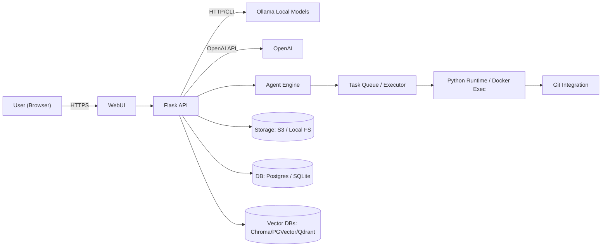

<!-- Hero image inserted by automation -->

# Y.S-UI

# 🚀 SHAHEEN -YS-UI

> Full-stack, enterprise-grade AI platform for local, hybrid and cloud deployments. Multi-agent orchestration, model routing, RAG, workspace, integrated terminal, Git/GitHub integration, plugin arc[...]

---

Table of Contents
-----------------

- [🌌 About](#🌌-about)
- [✨ Overview](#✨-overview)
- [🎯 Vision](#🎯-vision)
- [💡 Mission](#💡-mission)
- [🔥 Highlights](#🔥-highlights)
- [⭐ Features](#⭐-features)
- [🧠 AI Capabilities](#🧠-ai-capabilities)
  - [Multi-Agent AI](#multi-agent-ai)
  - [Local AI](#local-ai)
  - [Cloud AI](#cloud-ai)
  - [Model Routing](#model-routing)
  - [Model Comparison](#model-comparison)
  - [RAG](#rag)
  - [Memory](#memory)
  - [Voice](#voice)
  - [Image Generation](#image-generation)
  - [Code Execution & Python Runtime](#code-execution--python-runtime)
  - [Internet Search](#internet-search)
  - [Plugin System](#plugin-system)
  - [Workflow Engine](#workflow-engine)
- [🤖 Supported Models](#🤖-supported-models)
- [🔌 Integrations](#🔌-integrations)
- [🧩 Plugins Architecture](#🧩-plugins-architecture)
- [🛠 Built-in Tools](#🛠-built-in-tools)
- [🏗 Architecture](#🏗-architecture)
- [📐 System Design Decisions](#📐-system-design-decisions)
- [🔄 Workflow (Processing Pipeline)](#🔄-workflow-processing-pipeline)
- [📊 Performance & Optimization](#📊-performance--optimization)
- [🔐 Security & Privacy](#🔐-security--privacy)
- [🌐 Deployment](#🌐-deployment)
  - [Cloud Examples](#cloud-examples)
  - [Self-hosting](#self-hosting)
  - [Docker Compose](#docker-compose)
  - [Kubernetes (Helm friendly)](#kubernetes-helm-friendly)
- [📦 Installation & Quick Start](#📦-installation--quick-start)
- [⚙️ Configuration & Environment Variables](#⚙️-configuration--environment-variables)
- [💻 Development & Testing](#💻-development--testing)
- [📚 API Documentation (Selected Endpoints)](#📚-api-documentation-selected-endpoints)
- [🗄 Database & Storage](#🗄-database--storage)
- [🧠 Machine Learning Pipeline](#🧠-machine-learning-pipeline)
- [📁 Project Structure](#📁-project-structure)
- [🧬 Technology Stack](#🧬-technology-stack)
- [🛠 Developer Tools & Requirements](#🛠-developer-tools--requirements)
- [🚀 Quick Start & Examples](#🚀-quick-start--examples)
- [🔧 Advanced Configuration](#🔧-advanced-configuration)
- [🐳 Docker & ☸️ Kubernetes Manifests](#🐳-docker--️-kubernetes-manifests)
- [🔄 CI/CD & Release Workflow](#🔄-cicd--release-workflow)
- [📈 Roadmap & Milestones](#📈-roadmap--milestones)
- [🚧 Known Issues & Troubleshooting](#🚧-known-issues--troubleshooting)
- [📝 Changelog & Migration Guide](#📝-changelog--migration-guide)
- [🤝 Contributing & Community](#🤝-contributing--community)
- [📜 License & Legal](#📜-license--legal)
- [🙏 Acknowledgements](#🙏-acknowledgements)
- [📞 Contact & Links](#📞-contact--links)

---

🌌 About
--------

Agent System is an enterprise-ready AI orchestration platform that enables teams to run, orchestrate, and manage large language models (LLMs) and multi-agent workflows both locally and in the clou[...]

This repository provides the backend (Flask-based), a modern web UI, and a modular architecture built for extensibility, security, and enterprise deployment.

---

✨ Overview
-----------

- Single-repo solution for running AI agents and models.
- Supports local models (via Ollama), OpenAI-compatible backends, and hybrid cloud providers.
- Integrated developer workspace (file explorer, Monaco editor, terminal) for rapid prototyping and code execution.
- Multi-agent orchestration with dedicated agents (Planner, Developer, Reviewer, Security, Executor, GitHub, Architect).
- Model management, comparison, and fallback routing.
- Support for RAG, vector stores, memory, plugins and connectors.

Mermaid overview (architecture):

---

... (the rest of the README remains unchanged) ...

<!-- Insert second banner near Integrations -->

# Y.S-UI

